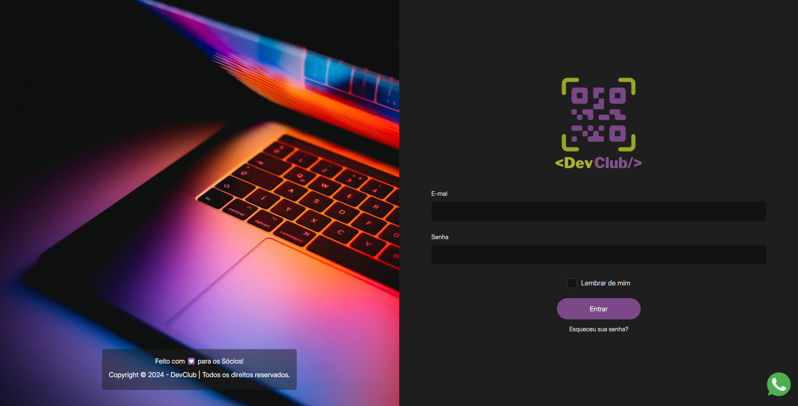
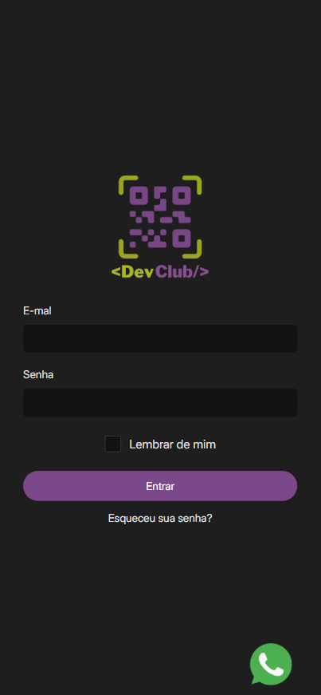

# DevClub - Página de Login

Este projeto consiste na criação de uma página de login responsiva com base na tela de login do site DevClub, utilizando HTML e CSS. O design da landing page foi desenvolvido com o objetivo de proporcionar uma experiência de usuário fluida e acessível em dispositivos de diferentes tamanhos, desde desktops até smartphones.

## 📸 Screenshots


| Desktop View | Mobile View |
| ------------ | ----------- |
|  |  |

## 🚀 Funcionalidades

- **Responsividade:** O layout se ajusta perfeitamente a qualquer dispositivo, garantindo uma boa usabilidade em desktops, tablets e smartphones.
- **Design Moderno:** Interface elegante e intuitiva, seguindo as tendências modernas de design.
- **Login Seguro:** Seção de login com campos para e-mail e senha, além de uma opção de "Lembrar de mim".
- **Integração com WhatsApp:** Ícone fixo no rodapé da página, permitindo acesso rápido ao WhatsApp.

## 🛠️ Tecnologias Utilizadas

- **HTML5:** Estrutura do conteúdo.
- **CSS3:** Estilização da página, incluindo responsividade e efeitos de hover.
- **Google Fonts:** Utilização da fonte "Inter" para uma tipografia moderna.

## 📁 Estrutura do Projeto

O projeto está organizado da seguinte forma:

```plaintext
├── assets/
│   ├── favicon.ico
│   ├── logo-devclub.webp
│   ├── login-bg.webp
│   ├── whatsapp.svg
│   └── [outras imagens]
├── index.html
├── style.css
└── README.md
```

## 📖 Como Utilizar

1. **Clone o Repositório**: 
   ```bash
   git clone https://github.com/seu-usuario/devclub-login.git
   ```
2. **Navegue até o Diretório do Projeto**:
   ```bash
   cd devclub-login
   ```
3. **Abra o arquivo `index.html` em seu navegador** para visualizar a página.

## 💻 Customização

Você pode personalizar esta página de login de acordo com suas necessidades. Abaixo estão algumas áreas que você pode querer ajustar:

- **Imagens e Logos**: Substitua as imagens na pasta `assets` pelas suas próprias.
- **Cores e Tipografia**: Ajuste as variáveis CSS no arquivo `style.css` para mudar as cores ou a fonte utilizada.
- **Campos do Formulário**: Adicione ou remova campos conforme necessário para o seu formulário de login.


---

Projeto feito com 💟 por [Diego Pereira](https://github.com/diegofelipeap) baseado na interface do DevClub.
